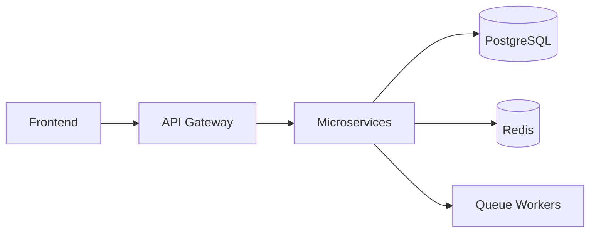

<div align="center">


<br/>


<br/>
<br/>

<a href="mailto:roman.ivanov@email.com">
  
</a>

<a href="https://github.com/romanivanov">
  
</a>

<a href="https://linkedin.com/in/romanivanov">
  
</a>

<a href="https://t.me/romanivanov">
  
</a>

<br/>
<br/>


</div>

---

# 💫 About Me

```bash
> whoami

Roman Ivanov — Fullstack Developer from Ukraine 🇺🇦

> specialization

Frontend:
Next.js / React / TypeScript / Vue

Backend:
Laravel / NestJS / Symfony / Microservices

> currently_building

Scalable web platforms
High-performance APIs
Modern DX-focused architectures

> interests

Clean Architecture
Performance Optimization
DevOps
Distributed Systems
```

---

# ⚡ Tech Stack

<div align="center">


</div>

---

# 🚀 Experience

<div align="center">

<table>
<tr>
<td width="50%">

### ⚡ Next.js Developer  
### Nimbus Systems  
`2024 — 2025`

- Built scalable SSR/SSG applications
- Improved frontend performance
- Developed reusable UI architecture
- Worked with TypeScript & API integrations

</td>

<td width="50%">

### 🔥 Laravel Fullstack Developer  
### CipherTech  
`2024 — 2025`

- REST APIs & authentication systems
- Vue.js admin dashboards
- Queue systems & caching
- PostgreSQL & Redis optimization

</td>
</tr>

<tr>
<td width="50%">

### 🧩 Symfony Fullstack Developer  
### Vertex Labs  
`2023 — 2024`

- Microservice architecture
- High-load backend systems
- Elasticsearch integrations
- Event-driven communication

</td>

<td width="50%">

### 🎨 Frontend Developer  
### Freelance  
`2022 — 2023`

- Responsive UI/UX
- React applications
- Landing pages & dashboards
- Performance optimization

</td>
</tr>
</table>

</div>

---

# 🧠 Architecture & Development

<div align="center">



</div>

---

# 📊 GitHub Analytics

<div align="center">


<br/>


</div>

---

# 🐍 Contribution Snake

<div align="center">


</div>

---

# 🌍 Languages

<div align="center">

| Language | Level |
|---|---|
| 🇺🇦 Ukrainian | Native |
| 🇬🇧 English | Fluent |
| 🇷🇺 Russian | Fluent |

</div>

---

# 🤝 Let's Connect

<div align="center">

<a href="mailto:roman.ivanov@email.com">
  
</a>

<a href="https://github.com/romanivanov">
  
</a>

<a href="https://linkedin.com/in/romanivanov">
  
</a>

<a href="https://t.me/romanivanov">
  
</a>

</div>

---

<div align="center">

## 💎 “Code. Architecture. Performance.”

<br/>


</div>
